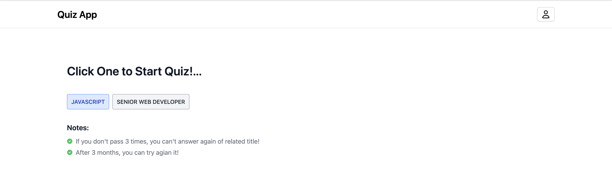
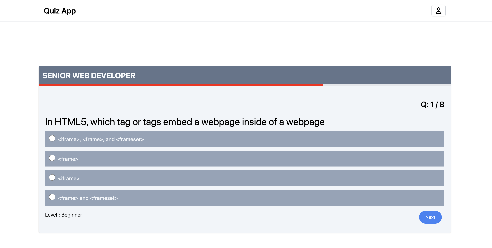

# Quiz App Project Description

This project harnesses the power of React.js, React Context API/Reducer, React Custom Hooks, TypeScript, Tailwind CSS, and Axios to create an immersive and secure environment for users.

# Technology Stack:
- Frontend Library: React.js
- State Management: React Context API/Reducer, React Custom Hooks
- Type Checking: TypeScript
- Styling: Tailwind CSS
- HTTP Requests: Axios

# Features:
## Authentication with JWT Token and Refresh Token:

- Implementing a secure login/logout system.
- Utilizing JWT tokens and refresh tokens for robust and secure authentication.

## Persistent Login:

- Ensuring persistent login functionality without storing sensitive data in browser cookies, sessions, or local storage.
- Prioritizing user experience and data security.

## Social Login (GitHub/Gmail):

- Enabling seamless authentication through GitHub and Gmail for user convenience.

## React Custom Hooks:

- Leveraging custom hooks to encapsulate and reuse logic across components, promoting a clean and modular codebase.

## PrivateRoute:

Implementing PrivateRoute components to protect routes and guarantee authorized access.

## Quiz with Timer:

- Crafting an engaging quiz interface complete with countdown timers to enhance user participation.
- Introducing time restrictions for each question to maintain an interactive environment.

## User Restrictions:

- Implementing restrictions to prevent users from attempting the same quiz title more than three times, ensuring fair usage.

## Result History:

- Empowering users to review their quiz result history, providing insights into their performance and progress.

## User Account Settings:

- Designing a user-friendly interface for users to manage their account settings, tailoring the app experience to their preferences.

# How to Run Local Environment

```
$ cd quiz-app
$ yarn start
```




